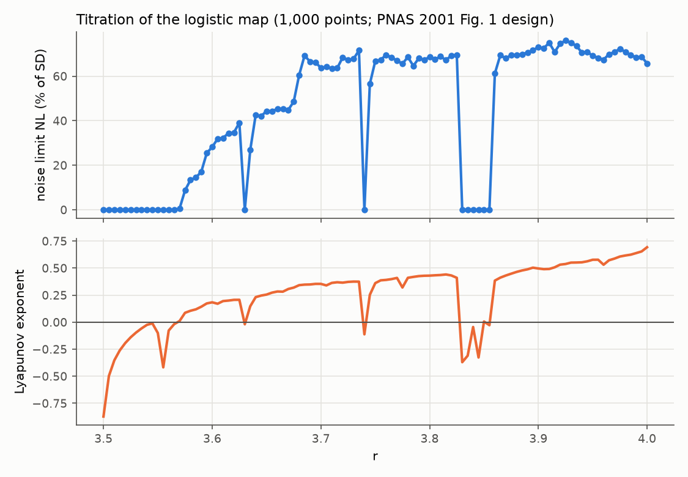
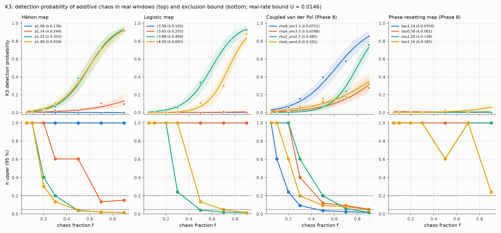
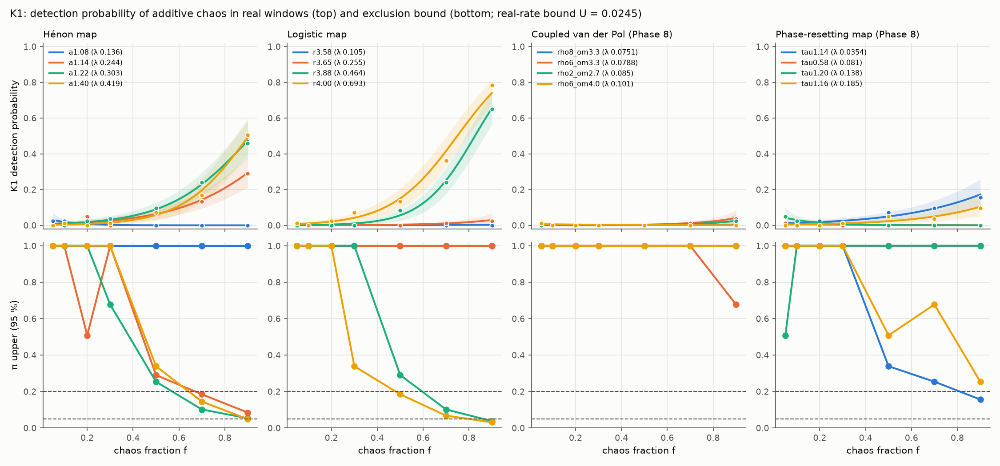
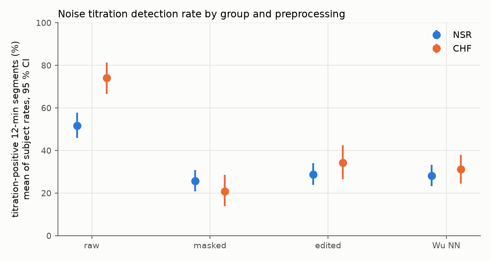
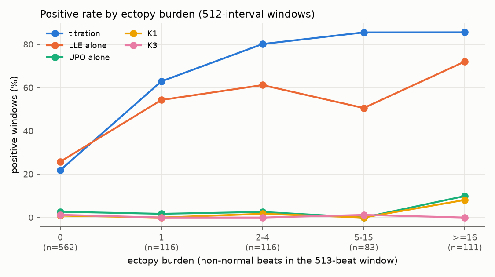

# Phase 10: Detection limits, faithful noise titration, ectopy dose-response and robustness (final question phase)

**Branch:** `claude/blissful-brahmagupta-th4tdh`. **Code:** `experiments/phase10_final/`.
- Living notes: `HANDOFF.md`.
- Sources, implementation choices and verification: `METHODS.md`.
- Preregistration: `PREREGISTRATION.md`, pushed in `8fc7bd9` before the confirmatory download, with
  amendments 1–2.
- Results: `results/conf/` (confirmatory) and `results/dev/` (development). Analysis outputs are in
  `results/conf/analysis/` (`analysis.json`, `tables.md`, `plots/`).

This is the last phase that asks new scientific questions. Later phases only fix, verify and prepare
figures.

**Final-refinement errata.** Eleven text corrections (E2–E12) were made after independent verification
(`experiments/final_refinement/VERIFICATION.md`, `ERRATA.md`). Each corrected passage is marked
`[Erratum En]`. No table, analysis output or conclusion changed.

## 1. Summary

- **Data.** Confirmatory data: nsr2db (54 healthy subjects, 58–76 y) and chf2db (29 CHF subjects, NYHA
  I–III); 988 windows of 512 intervals and 9,536 twelve-minute segments. Neither database had been
  analysed before. No subject overlaps the development databases (Amendment 1). All annotation files are
  at 128 Hz.
- **Q1, detection limits (P1).** Chaos was added to each subject's real RR window as an independent
  component carrying a fraction f of the variance. This models hidden chaos, not a chaotic heart.
  - **K3** saw strongly chaotic maps (Hénon a ≥ 1.22, logistic r ≥ 3.88) and one coupled-vdP regime well
    enough to exclude them in ≥ 5 % of windows when f ≥ 0.5–0.7, and in ≥ 20 % when f ≥ 0.3–0.5.
  - K3 essentially never detected the weakest maps (logistic λ ≤ 0.26, Hénon λ = 0.14 per beat) or any
    phase-resetting regime, so no bound is possible for them at any f. Hénon a = 1.14 (λ = 0.24) is bounded
    only at π < 0.20, from f = 0.7. [Erratum E6]
  - **K1** reached π < 0.20 from f = 0.5–0.7 for Hénon a ≥ 1.14 and logistic r ≥ 3.88 (and from f = 0.9 for
    phase-reset τ = 1.14), and π < 0.05 only at f = 0.9 (Hénon a = 1.40, logistic r = 3.88 and 4.00).
    [Erratum E7]
- **Q2, faithful titration.**
  - The Poon–Barahona titration was rebuilt from the accessible sources and **verified** against the
    PNAS 2001 behaviour.
  - **P2.** On raw RR, CHF had *more* titration positives than healthy subjects: 74.2 % vs 51.7 %,
    difference +22.4 % [12.8, 31.7]. That is the opposite direction to "decreased cardiac chaos in CHF".
  - Masking ectopy-related intervals lowered positives by 47 points in CHF and 26 in NSR, and removed the
    group difference (−4.9 % [−13.7, +4.3]). Editing and Wu-style ectopy elimination agreed.
  - On synthetic checks the verified method is specific for linear noise, but positive in 96–100 % of
    windows with couplets or runs, with a static nonlinear warp, or with one forced quasi-periodic
    rhythm.
- **Q3, dose-response (P3).**
  - **Titration positives track ectopy**: OR 2.31 [1.67, 3.19] per doubling of 1 + burden; 22 % positive
    with no ectopic beat vs 63 % with one.
  - **K3 positives do not**: 8 positives, 7 of them in ectopy-free windows; too few for a model.
  - LLE alone and K1 also track ectopy.
  - Adjusted for burden, the titration CHF effect disappears: OR 0.77 [0.46, 1.28].
- **Q4, robustness (secondary).** 499 surrogates changed at most 6 window decisions per detector in 331
  windows (LLE alone 3 + 3; K1, UPO alone and K3 at most 2). [Erratum E8] K3
  rose from 0.3 % to 2.8 % at 1,024 intervals. Night vs day was not decisive (clock times approximate).
  K3 detections disappear without annotation labels (K4, K3RR 0/988).
- **Overall.** The published titration evidence for heart-rate chaos, and for its "decrease" in CHF, is
  explained by ectopic beats and by the indicator's sensitivity to non-chaotic nonlinearity. No
  preregistered detector found evidence of deterministic chaos in human RR intervals beyond its known
  false-positive sources.

## 2. Provenance and design

| Item | Value |
|---|---|
| Branch | `claude/blissful-brahmagupta-th4tdh`, from `main` at `71a4f7c` (Phases 2E–9). `main` was confirmed to contain `docs/PHASE9_WAVEFORM_NOISE_ROBUST.md` and `final_pipeline.masked_growth_chaos_test` |
| Environment | Python 3.13.14, numpy 2.1.3, scipy 1.18.1, scikit-learn 1.9.1, pandas 3.0.6, wfdb 4.3.1, numba 0.68.0; statsmodels 0.15.0 added for the GEE (`requirements-phase10.txt`). BLAS 1 thread, 4 workers |
| pytest baseline | 462 passed + the 1 pre-existing `prl_norm` failure (default); 463 passed with AVX-512 dispatch disabled. Identical to Phase 9 |
| `final_pipeline.py` | **unchanged** in Phase 10 (0 diff lines against `main`), so the ground-rule check was not required. The 499-surrogate runs use existing `PipelineConfig` fields |
| Detectors (frozen) | K1 = Phase 9 `k1_frozen512` (Phase 6 combined AND detector, `keep_upo_on_short_lle_embedding = True`, D2 detrend; 99 LLE + 50 UPO surrogates); K3 = `final_pipeline.masked_growth_chaos_test` with the frozen `masked_growth_*` parameters. Components LLE alone and UPO alone are secondary |
| Data split | DEVELOPMENT: MIT-BIH, nsrdb, chfdb (all code built and debugged on these). CONFIRMATORY: nsr2db (54 subjects) and chf2db (29), never analysed before |
| Discipline | `PREREGISTRATION.md` committed and pushed in `8fc7bd9` **before** nsr2db / chf2db were downloaded; the runner and the download refuse to start otherwise (Phase 3 guard), and the confirmatory run also refuses to start before the overlap check. One amendment (`4795cf6`), made after the download and the overlap check but **before any detector, titration or HRV output on confirmatory data existed** (Section 10) |
| Code | `experiments/phase10_final/`: `titration10.py` (noise titration), `verify_titration.py`, `data10.py`, `harness10.py`, `run10.py`, `overlap10.py`, `analysis10.py`, `tables10.py`, `figures10.py`; sources and choices in `METHODS.md`; living notes in `HANDOFF.md` |

## 3. Data and overlap checks (`overlap10.py`, `results/conf/data_checks*.json`)

| check | result |
|---|---|
| Files | nsr2db 54 and chf2db 29 records (headers + `.ecg` beat annotations); every SHA-256 equals PhysioNet's `SHA256SUMS.txt` |
| Annotation resolution | **128 Hz in every record** (1/128 s = 7.8 ms, coarser than MIT-BIH's 1/360 s). Every Question 1 spike-in was therefore quantized at 1/128 s (development spike-ins at each development record's own rate: nsrdb 128 Hz, chfdb 250 Hz) |
| Start times | **none of the 83 headers has a start time.** As preregistered, clock time was approximated as 09:54 (the median start time of the 33 development long-term records) + elapsed time; every confirmatory night/day result is an approximation |
| Metadata | headers carry age and sex (chf2db: sex unknown for 21) and NYHA class (chf2db: I–III). nsr2db ages 58–76 y vs nsrdb 20–50 y; chf2db NYHA I–III vs chfdb III–IV |
| Documentation | nsr2db: Washington University (P. Stein) and Columbia-Presbyterian (R. Goldsmith); chf2db: Columbia-Presbyterian; nsrdb and chfdb: Beth Israel Hospital, Boston. No overlap is implied |
| Beat symbols | nsr2db: N 5,769,155, A 12,886, V 8,463 (+ non-beat `~`, `|`); chf2db: N 3,200,657, A 25,442, V 86,096 (+ `~`, `|`) |
| Windows | 988 windows of 512 intervals (49 + 27 subjects with all 12, 7 subjects with 10–11 [Erratum E2]; recordings 17–24 h) |

**Subject overlap.** The preregistered RR-matching rule (5 probes of 500 intervals per confirmatory record;
a probe matches when the median absolute interval difference at the best-correlation lag is below 2/128 s;
a pair overlaps when ≥ 2 probes match) flagged 13 pairs involving 10 chf2db subjects. All of them are
chance matches:
- three chf2db records "matched" two different chfdb subjects each;
- in every flagged pair the probes matched positions that are mutually inconsistent in time. For example,
  chf205's probes taken at hours 14 and 18 both matched the same ≈ 3-min stretch of chfdb chf09;
- the matching probes had very low variability (SD 0.006–0.05 s). With 1/128 s quantization and about
  10⁵ candidate lags, a 2-sample median difference occurs by chance;
- metadata contradicts identity (chf205 is 39 y, male; it "matched" chf09, 63 y, female, and chf13,
  61 y, male).

Amendment 1 replaced the rule by a time-consistent one: a pair overlaps when ≥ 3 probes match at one
common time offset (± 120 s). The amended rule was validated on development data before use. It
found re-annotated duplicates of four development records (shifted 37 min, re-quantized at 1/128 s with
±1-sample jitter) with 5/5 consistent probes, and flagged no distinct pair. On all 2,739
confirmatory × development pairs, the largest number of time-consistent probes was 1. **No confirmatory
subject overlaps a development subject, and none was excluded.** As preregistered in the amendment, the
primary outcomes are repeated without the 10 originally flagged subjects (Section 9.x).

## 4. Noise titration: faithful implementation and verification (Question 2a–2b)

### 4.1 Sources and what could be read

| source | access | used for |
|---|---|---|
| Poon & Barahona, PNAS 98:7107 (2001), PMC34630 | full text through the PMC page (XML and PDF blocked) | titration algorithm and noise-limit definition (Fig. 1 legend); verification values (Fig. 2); qualitative Figs. 3–5 |
| Wu et al., PLoS ONE 4:e4323 (2009) | open (CC-BY; copies in `sources/`) | VWK model (Eq. 1), C(r) = log ε(r) + r/N with r = number of leading terms (Eq. 2), F-test at 1 %, 5–10 repetitions; the HRV study design |
| Wysocki et al. 2006, arXiv:nlin/0606032 | open | best linear model = d = 1 with κ minimising the Akaike criterion; best nonlinear d > 1; F-test / Whitney–Mann at 1 %; routine defaults κ = 6, d = 3 |
| Poon, Li & Wu, arXiv:1004.1427 | open | same restatement as Wu 2009 |
| Barahona & Poon, Nature 381:215 (1996) | **not accessible** (paywall) | the indicator's primary definition, taken from the restatements above |
| Poon & Merrill, Nature 389:492 (1997) | **not accessible**; abstract only | the CHF claim |

### 4.2 Implementation (`titration10.py`)

- **Model.** The VWK polynomial autoregression y_n = a₀ + Σ a_j y_{n−j} + all products of the lags up
  to degree d. Terms are ordered by degree, then lexicographically.
- **Fitting.** Every leading set of r terms is fitted by least squares through modified Gram–Schmidt
  (Korenberg's recursive orthogonal estimation).
- **Criterion.** ε(r) is the normalised RMS one-step error and C(r) = log ε(r) + r/N.
- **Model selection.** The best linear model minimises C over d = 1. The best nonlinear model minimises C
  over the leading truncations that contain a nonlinear term, with κ ≤ 6 and d ≤ 3.
- **Decision.** The series is nonlinear when C_nl < C_lin and the F-test rejects at 1 %.
- **Titration.** For each of 10 realisations of unit-variance white noise ξ, bisection finds the largest
  α such that y + αξ is still nonlinear; NL = mean α/σ_y. A window is positive when NL > 0.

Three readings had to be chosen because the accessible sources are ambiguous (METHODS.md 2.3):
1. **ε is an RMS, not a variance.** Only then is Eq. 2 Akaike's criterion, as all three sources call it.
2. **The F-test compares the two models' residual variances.** The sources pair it with a Mann–Whitney
   test, which compares two residual samples.
3. **The linear family may use up to M − 1 = 83 lags** (as many terms as the largest nonlinear model).
   PNAS 2001 states that periodic signals titrate to zero "because a nonlinear limit cycle can be
   described … by linear models of enough memory". With linear memory ≤ 6, its periodic example is not
   reproduced (NL 0.64 instead of ≈ 0).

### 4.3 Verification (criteria fixed in METHODS.md 2.5 before running; `results/verification/`)




| check | published behaviour | this implementation | pass |
|---|---|---|---|
| V1 logistic r = 3.7 (used to choose readings) | NL ≈ 75 % | 63.7 % | yes (±15 points) |
| V2 r = 3.575 (used to choose readings) | ≈ 9 % | 8.7 % | yes |
| V3 r = 3.565, periodic (used to choose readings) | ≈ 0 % | 0.0 % | yes |
| V4 bifurcation scan r = 3.50–4.00 (Fig. 1) | NL > 0 iff LE > 0; NL ∝ LE | NL > 0 at 78/78 chaotic r, NL = 0 at 18/18 periodic r; Spearman(NL, LE) = 0.85 | yes |
| V5 non-chaotic controls (20 each) | NL = 0 | white noise 0/20, AR(2) 0/20, 3-harmonic limit cycle 0/20, 2-torus 0/20, logistic period 3 0/20 | yes |
| V6 flows (Figs. 3c, 5) and Hénon | chaotic NL > 0, periodic NL = 0 | Lorenz r = 28: 61 %; r = 160 (limit cycle): 0; Mackey–Glass τ = 17 / 23 / 30: 33 / 68 / 66 %; τ = 14 / 15 / 16: 0 / 0 / 0; Hénon 77 % | yes |

**The implementation is VERIFIED.** The published pattern is reproduced
(`plots/fig_titration_verification.png`). The one numerical gap is r = 3.7: 64 % here against ≈ 75 %
read from the published figure.

### 4.4 What data the key positive studies used (Question 2c; METHODS.md 2.7)

- **Wu et al. 2009** is the "transient chaos" study that ties CHF chaos to ectopic beats.
  - Groups: young subjects (n = 13, 32 ± 8 y) and CHF patients (n = 14, NYHA III–IV) "from the PhysioNet
    database", which matches nsrdb and chfdb (this project's development data), plus 16 elderly subjects
    from the authors' own laboratory.
  - Selection: subjects were "selected on the basis of stability of the mean heart rate and limited
    number of ectopic beats".
  - Preprocessing: RR intervals with premature, missing and ectopic beats eliminated without
    interpolation, then manual removal of residual premature beats.
  - Segmentation: 24 h divided into 12-min segments of about 800 beats, "as with previous studies"
    (Poon & Merrill 1997).
  - Outcomes: DR (% of segments with nonlinearity detected) and NL (averaged over detected segments only).
  - Their Fig. 2C reports a CHF segment with NL = 134 % that fell to 0 after manual removal of RR
    "spikes".
- **Poon & Merrill 1997** ("decrease of cardiac chaos in CHF"): healthy subjects and severe CHF.
  PhysioNet lists it as a user of chfdb.
- **Neither study used nsr2db or chf2db.** Phase 10 applies the study-faithful version to the
  confirmatory databases: 12-min segments, elimination of ectopy-involved intervals without interpolation,
  and the routine defaults κ = 6, d = 3. Manual removal of beats is not reproducible: the RR databases have
  no ECG.

## 5. Question 1: detection limits on real human recordings (P1)

**An additive chaotic component is a model of hidden chaos, not of a chaotic heart.**

**Design.**
- **Base windows.** One window of 512 intervals per confirmatory subject (83 in total).
- **Additive design.** x' = x + s·c, with f = var(chaos) / (var(chaos) + var(NN part)) for
  f ∈ {0.05, 0.1, 0.2, 0.3, 0.5, 0.7, 0.9}. Beat times are quantized to 1/128 s. The real labels and
  ectopy are kept.
- **Replacement design.** Phase 7's replacement design is reported as secondary.
- **Real-rate bound.** U = max(cluster-bootstrap 95th percentile, one-sided Clopper–Pearson).
- **Exclusion bound.** π_upper(f) = U / p_emp(f) at each design f (model-free, Section 4 of the
  preregistration). f_min is the smallest design f with π_upper below the threshold at that f and at
  every larger f.
- **Run.** 1,328 tasks, 10,624 spiked series, 0 errors.

### 5.1 K3 (real detections 8/988; U = 0.0146)




| family | parameter (λ) | detected / 83 at f = 0.05 … 0.9 | replacement | **f_min, π < 0.05** | **f_min, π < 0.20** |
|---|---|---|---|---|---|
| Hénon | a = 1.08 (0.136/beat) | 0 1 0 0 0 0 0 | 0 | none | none |
| Hénon | a = 1.14 (0.244) | 0 0 0 2 2 9 8 | 4 | none | 0.7 |
| Hénon | a = 1.22 (0.303) | 0 0 3 6 32 58 76 | 33 | **0.5** | **0.5** |
| Hénon | a = 1.40 (0.419) | 0 1 4 9 29 58 76 | 69 | **0.5** | **0.3** |
| logistic | r = 3.58 (0.105) | 0 0 0 0 0 0 0 | 0 | none | none |
| logistic | r = 3.65 (0.255) | 0 0 0 0 0 1 0 | 0 | none | none |
| logistic | r = 3.88 (0.464) | 1 1 1 5 28 59 77 | 62 | **0.5** | **0.5** |
| logistic | r = 4.00 (0.693) | 0 0 0 1 9 25 73 | 76 | **0.7** | **0.5** |
| coupled vdP | (8, 3.3) (0.075/model unit) | 1 2 5 13 33 48 71 | 31 | **0.5** | **0.3** |
| coupled vdP | (6, 3.3) (0.079) | 0 0 0 3 10 13 23 | 45 | none | 0.5 |
| coupled vdP | (2, 2.7) (0.085) | 0 0 0 2 6 20 63 | 60 | 0.9 | 0.7 |
| coupled vdP | (6, 4.0) (0.101) | 0 1 2 6 13 15 27 | 25 | 0.9 | 0.5 |
| phase-reset | τ = 1.14, 0.58, 1.20, 1.16 (0.035–0.185/stimulus) | ≤ 5 at any f | 0–10 | none | none |

### 5.2 K1 (real detections 16/988; U = 0.0245)




| family | parameter | detected / 83 at f = 0.05 … 0.9 | replacement | f_min, π < 0.05 | f_min, π < 0.20 |
|---|---|---|---|---|---|
| Hénon | a = 1.08 / 1.14 / 1.22 / 1.40 | 2 2 0 0 0 0 0 / 0 0 4 0 7 11 24 / 0 0 2 3 8 20 38 / 0 1 0 1 6 14 42 | 0 / 19 / 40 / 54 | none / none / none / 0.9 | none / 0.7 / 0.7 / 0.7 |
| logistic | r = 3.58 / 3.65 / 3.88 / 4.00 | 0 … 0 / ≤ 2 / 0 0 0 0 7 20 54 / 1 0 2 6 11 30 65 | 0 / 1 / 38 / 53 | none / none / 0.9 / 0.9 | none / none / 0.7 / 0.5 |
| coupled vdP | all four | ≤ 3 at any f | 0–7 | none | none |
| phase-reset | τ = 1.14 / 1.16 (others ≈ 0) | … 13 / … 8 | 0 / 18 | none | 0.9 / none |

**Findings (P1).**
- **K3 rules out moderately strong chaos at moderate size.** For the stronger Hénon and logistic maps
  (λ ≥ 0.30 per beat) and one coupled-vdP regime, chaos accounting for ≥ 50 % of beat-to-beat variance
  (f ≥ 0.5; f ≥ 0.7 for logistic r = 4.00 [Erratum E9]) can be present in at most 5 % of real windows. At f ≥ 0.3–0.5 it can be present in at most
  20 %.
- **Exclusion is possible only from f ≈ 0.5 upwards.** Below f = 0.3 no family is excluded at any
  threshold.
- **No bound exists in four cases**, because K3 essentially never detected them:
  - weak chaos (logistic λ ≤ 0.26, Hénon λ = 0.14);
  - every phase-resetting regime;
  - Hénon a = 1.14 at π < 0.05;
  - vdP (6, 3.3) at π < 0.05.
- **Per family, for every λ tested**, the only exclusion is coupled vdP at π < 0.20 from f = 0.7. Hénon,
  logistic and phase-reset have no such f.
- **K1 (AND detector) gives weaker bounds.** π < 0.20 from f = 0.5–0.7 for Hénon a ≥ 1.14 and logistic
  r ≥ 3.88 (from f = 0.9 for phase-reset τ = 1.14), π < 0.05 only at f = 0.9 (Hénon a = 1.40, logistic
  r ≥ 3.88), and no bound at all for coupled vdP. [Erratum E7] LLE alone, with 401/988 real positives (U = 0.45), gives no bound
  anywhere.
- **The replacement design (100 % chaos plus real ectopy)** is detected by K3 in 0–92 % of windows,
  depending on the family.
- **Secondary versions agree.** The Wilson-lower-bound version shifts several f_min one design step
  higher. The Firth-fit version (descriptive) gives interpolated values 0.21–0.53 for the excluded
  families.

## 6. Question 2c–2d: noise titration on the confirmatory databases (P2)




12-min segments (Wu et al. 2009 segmentation), 9,536 segments, of which 8,993 were analysable
(intervals outside [0.25, 3.0] s cover < 10 % and ≥ 400 intervals remain); 54 NSR and 29 CHF
subjects. DR = per-subject fraction of titration-positive (NL > 0) segments; group values are means of
subject DRs with subject-cluster bootstrap 95 % CIs.

| arm | NSR DR [95 % CI] | CHF DR [95 % CI] | CHF − NSR [95 % CI] | permutation p |
|---|---|---|---|---|
| **raw RR (P2)** | **51.7 % [46.0, 57.7]** | **74.2 % [66.5, 81.4]** | **+22.4 % [+12.8, +31.7]** | 0.0001 |
| masked, K3 rule (analysable segments) | 25.7 % [20.9, 30.9] | 20.8 % [13.8, 28.5] | −4.9 % [−13.7, +4.3] | 0.29 |
| edited, Phase 7 (eligible segments) | 28.9 % [23.9, 34.2] | 34.3 % [26.6, 42.4] | +5.4 % [−3.9, +14.7] | 0.24 |
| Wu preprocessing (ectopy eliminated, NN concatenated) | 28.2 % [23.3, 33.4] | 31.1 % [24.5, 38.1] | +2.9 % [−5.3, +11.4] | 0.50 |

| change from raw (same segments) | group | segments | raw DR → arm DR | mean change [95 % CI] | raw positives removed |
|---|---|---|---|---|---|
| **masked (P2)** | NSR | 5,671 | 51.8 % → 25.7 % | **−26.1 % [−32.4, −20.1]** | 49 % |
| **masked (P2)** | CHF | 1,865 | 67.7 % → 20.8 % | **−46.8 % [−59.1, −34.5]** | 66 % |
| masked, non-analysable counted negative | NSR / CHF | 5,964 / 3,029 | | −27.5 % / −59.6 % | 53 % / 81 % |
| edited | NSR / CHF | 5,910 / 2,763 | | −23.0 % [−28.9, −17.4] / −36.7 % [−46.7, −26.9] | 44 % / 55 % |
| Wu preprocessing | NSR / CHF | 5,946 / 3,017 | | −23.6 % [−29.6, −17.9] / −43.1 % [−52.7, −33.4] | 46 % / 60 % |

- **On raw RR, titration finds *more* "chaos" in CHF than in healthy subjects.** This is the opposite of
  the "decreased cardiac chaos in CHF" claim. Wu et al. reported the same direction for noise limits
  ("transient chaos" in CHF) and tied it to ectopic beats.
- **Masking ectopy-related intervals removes the excess.** It lowers the CHF rate by 47 points and the
  NSR rate by 26 points, and the group difference disappears (−4.9 %, CI includes 0). Editing and
  Wu's elimination give the same result. As predicted, masking changes CHF more than NSR.
- **About half of the healthy subjects' raw positives are also ectopy-related.** The nsr2db subjects are
  58–76 y and carry atrial and ventricular ectopic beats. In development, nsrdb (20–50 y, almost no ectopy)
  lost only 4–6 % of positives (3.5–6.1 % across the masked, edited and Wu arms). [Erratum E12]
- **About a quarter to a third of segments stay titration-positive after ectopy is removed, in both
  groups.** By the method's own logic this is "chaos". Phases 5–9 and Q2e show the indicator is also
  positive for static nonlinearity and some non-chaotic forced rhythms, so these remaining positives are
  not evidence of chaos.
- **Noise limits.** Mean NL among positive segments: raw NSR 0.37 vs CHF 0.59; Wu arm 0.19 vs 0.33.
- **Analysability and model fallback.** The masked arm was analysable in 95 % of NSR but only 62 % of
  CHF segments (dense ectopy). The edited arm was eligible in 99 % / 91 %. The segment GEE (positive ~
  burden + CHF) needed the Amendment 2 fallback: burden OR 1.99 [1.51, 2.62] per doubling, CHF OR 0.87
  [0.55, 1.36].
- **Night vs day** (approximate clock): NSR 55.8 % vs 50.4 %; CHF 72.0 % vs 75.1 %.

### 6.2 Q2e: false positives of the verified titration on the validated synthetic checks

Seeds 10100–10199 (100 windows per condition), 512 intervals (800 in parentheses), true beat types as
labels. All conditions are non-chaotic, so every positive is a false positive.

| condition | raw | raw re-quantized 1/128 s | edited (eligible) | masked (analysable) |
|---|---|---|---|---|
| N1 linear, N2 power-law, N3 trend, N6 noisy RSA | 0 (0) each | 0 | 0 | 0 (100) |
| N4 level step | 10 (1) | 0 (0) | 10 (1) | 10 (100) |
| **N5 static monotone warp of linear RR** | **100 (100)** | 99 (98) | 100 | 100 (100) |
| S1 SETAR | 0 (3) | 0 (3) | 0 (3) | 0 (100) |
| S2 isolated ectopy 5 % / 10 % | 5 (2) / 0 (0) | 5 (0) / 0 | 12 (13) / 1 (0) | not analysable |
| E1 bigeminy / E2 trigeminy | 0 / 0 | 0 / 0 | not eligible | not analysable |
| **E3 couplets 5 % / 10 %** | **100 / 100 (100 / 100)** | 100 / 100 | 39 (38) / 23 (15) | not analysable |
| **E4 VT runs** | **96 (99)** | 96 (99) | 11 (6) | 0 of 56 (0 of 100) |
| E5 atrial 5 % / 10 % | 2 (4) / 0 (0) | 1 (2) / 0 | 21 (11) / 10 (3) | not analysable |
| E6 ectopy + trend | 0 (0) | 0 | 0 | not analysable |
| **vdP (5.45, 5.6), forced quasi-periodic, no ectopy** | **100 (100)** | 96 (100) | 100 | 100 (100) |
| vdP (5.45, 5.6) + E1 / + E3 / + S2 | 32 (38) / 94 (94) / 1 (0) | 31 / 93 / 1 | – / 100 / 100 | not analysable |
| other 5 non-chaotic vdP regimes, no ectopy | 0 (0) each | 0 | 0 | 0 (100) |
| vdP (2, 5.6), (4, 5.6), (6, 5.6) + E3 couplets | 100 (100) each | 100 | 100 / 44–82 / 100 | not analysable |
| vdP (9.6, 2.1), (10, 3.3) + E3 | 9 (0) / 0 (0) | 8 / 0 | 29 (11) / 9 (0) | not analysable |
| non-chaotic vdP + S2 isolated ectopy | 0–1 | 0–1 | **71–100 for (2, 5.6), (4, 5.6), (6, 5.6), (5.45, 5.6)**; 20 (9.6, 2.1); 0 (10, 3.3) | not analysable |

**Specific, unlike the approximate version.** The verified titration is specific on linear nulls, SETAR
and isolated ectopy. The approximate Phase 8 version was positive on SETAR (43/100), N4 (98/100) and
every ectopy pattern.

**False positives remain:**
- **Static nonlinearity.** A monotone warp of linear RR (N5) is positive in 100 %.
- **Clustered ectopy.** Couplets and runs are positive in 96–100 %.
- **One non-chaotic forced rhythm.** vdP (5.45, 5.6) without ectopy is positive in 100 %.

**Editing creates positives.** Edited isolated ectopy in deterministic rhythms is positive in 71–100 %:
interpolated stretches look like low-dimensional structure (as Phase 6 found for the LLE test).

**The masked arm cannot be assessed here.** At 5–10 % ectopy no regression row has the 84 clean
intervals it needs.

**Resolution does not matter.** Re-quantization to 1/128 s changes almost nothing, except removing the
N4 positives.

These are the false-positive sources that remain open for the real-data positives that survive masking
(Section 6).

## 7. Question 3: ectopy dose-response (confirmatory, 988 windows of 512 intervals, 83 subjects)




Ectopy burden = annotated non-normal beats among the window's 513 beats. Model (preregistered): GEE,
logit P(positive) = b0 + b1 log2(1 + burden) + b2 CHF, exchangeable working correlation, robust SE. For
titration the exchangeable fit diverged and the independence working correlation was used (Amendment 2).

| outcome | positive windows | OR per doubling of (1 + burden) [95 % CI] | p | CHF OR adjusted for burden |
|---|---|---|---|---|
| **titration (P3)** | 455 / 988 | **2.31 [1.67, 3.19]** | 5 × 10⁻⁷ | 0.77 [0.46, 1.28], p = 0.31 |
| **K3 (P3)** | 8 / 988 | **not estimable** (< 10 positives) | | |
| LLE alone | 401 | 1.51 [1.31, 1.75] | 2 × 10⁻⁸ | 0.79 [0.49, 1.28] |
| UPO alone | 31 | 1.17 [1.00, 1.37] | 0.053 | 2.13 [1.00, 4.55] |
| K1 | 16 | 1.44 [1.09, 1.90] | 0.010 | 2.33 [0.57, 9.41] |

| burden (beats) | windows | subjects | titration | LLE alone | UPO alone | K1 | K3 |
|---|---|---|---|---|---|---|---|
| 0 | 562 | 72 | 123 (22 %) | 145 (26 %) | 15 (3 %) | 5 (1 %) | 7 (1.2 %) |
| 1 | 116 | 55 | 73 (63 %) | 63 (54 %) | 2 (2 %) | 0 | 0 |
| 2–4 | 116 | 39 | 93 (80 %) | 71 (61 %) | 3 (3 %) | 2 (2 %) | 0 |
| 5–15 | 83 | 26 | 71 (86 %) | 42 (51 %) | 0 | 0 | 1 (1.2 %) |
| ≥ 16 | 111 | 20 | 95 (86 %) | 80 (72 %) | 11 (10 %) | 9 (8 %) | 0 |

**3a (P3).**
- **Titration positives track ectopy**, as predicted. A single annotated ectopic beat in 512 intervals
  nearly triples the positive rate (22 % → 63 %).
- **K3: prediction not contradicted.** K3 positives are too rare for a dose-response (8 windows). Seven
  of the eight are in ectopy-free windows. The rate difference burden ≥ 1 minus burden 0 is −0.7 %
  [−1.6, +0.03].
- **Secondary.** LLE alone also tracks ectopy, as Phases 5–7 predicted. So does K1 (16 positives;
  9 of them in windows with ≥ 16 ectopic beats).
- Unadjusted burden ORs: titration 3.85 [2.30, 6.46], LLE 1.48, UPO 1.28, K1 1.56.

**3b (paired, same windows).**

| comparison | windows (with ≥ 1 masked interval) | raw positive | positive after | raw positives removed | mean subject-level change [95 % CI] |
|---|---|---|---|---|---|
| titration raw → masked (K3 rule) | 281 analysable | 134 | 62 | 57.5 % | −31.5 % [−40.8, −22.4] |
| titration raw → edited (Phase 7) | 504 eligible | 318 | 114 | 66.0 % | −36.8 % [−44.5, −29.3] |
| LLE raw → edited | 504 | 263 | 168 | 47.1 % | −19.5 % [−25.8, −13.3] |
| K1 raw → edited | 504 | 7 | 4 | 71.4 % | −0.5 % [−1.4, 0.2] |
| UPO raw → edited | 504 | 14 | 18 | 64.3 % | +0.6 % [−0.9, 2.3] |

Masking or editing removes most titration positives (57.5 % masked, 66.0 % edited) and about half of the LLE
positives (47.1 % edited) in windows that contain ectopy. [Erratum E10] Editing also
*creates* some positives: 6 new titration-positive and 29 new LLE-positive windows (raw-negative windows
that became positive). This matches the Phase 6 finding that interpolated stretches look structured.
The masked titration arm is not analysable when ectopy is dense: it needs ~84 clean consecutive
intervals per regression row. Only 281 of the windows with masked intervals were analysable.

**3c.** The titration group difference (CHF more often positive) is OR 2.60 [1.64, 4.13] unadjusted
and **0.77 [0.46, 1.28] after adjusting for ectopy burden**. At the 512-window level, the group
difference in titration positives is fully accounted for by ectopy.

## 8. Question 4: robustness (secondary; confirmatory, with development comparison where run)

### 8.1 Surrogate count (4a; windows j = 1, 4, 7, 10; 331 windows)

| detector | default + / 499 + | both | default only | 499 only | agreement | κ |
|---|---|---|---|---|---|---|
| K1 | 9 / 8 | 8 | 1 | 0 | 99.7 % | 0.94 |
| LLE alone | 143 / 143 | 140 | 3 | 3 | 98.2 % | 0.96 |
| UPO alone | 12 / 10 | 10 | 2 | 0 | 99.4 % | 0.91 |
| K3 | 1 / 1 | 1 | 0 | 0 | 100 % | 1.00 |

Surrogate Monte Carlo error changes at most 6 window decisions per detector (LLE alone: 3 in each direction;
K1 1, UPO alone 2, K3 0). [Erratum E8]

### 8.2 Window length (4b; 320 windows available at all three lengths)

| detector | 256 | 512 | 1024 |
|---|---|---|---|
| K1 | 0.3 % | 2.8 % | 2.8 % |
| LLE alone | 28.4 % | 42.2 % | 53.1 % |
| UPO alone | 1.9 % | 3.8 % | 4.7 % |
| K3 | 0.3 % | 0.3 % | **2.8 %** |

- **K3 is length-sensitive.** It detected 9/320 windows at 1,024 intervals, against 1 at 512 and 1 at 256.
  - Six of the nine are ectopy-free.
  - Five of the six subjects with 512-interval detections recur (nsr029, nsr049, chf211, chf216,
    chf218); chf211 window 7 is detected at 256, 512 and 1,024 intervals. [Erratum E11]
  - K3 was calibrated at 512 intervals only. Longer windows accumulate nonstationarity, which can produce
    determinism-like predictability.
- **LLE alone** fires more at longer lengths, as its power to reject the linear null grows.

### 8.3 Time of day (4c; clock time approximate: no header start times, assumed 09:54 start)

| detector | NSR night | NSR day | CHF night | CHF day |
|---|---|---|---|---|
| titration | 66/152 (43 %) | 177/490 (36 %) | 47/82 (57 %) | 165/264 (63 %) |
| LLE alone | 40/152 | 190/490 | 33/82 | 138/264 |
| UPO alone | 1/152 | 11/490 | 3/82 | 16/264 |
| K1 | 1/152 | 3/490 | 2/82 | 10/264 |
| K3 | 1/152 | 4/490 | 0/82 | 3/264 |
| K4 | 0/152 | 0/490 | 0/82 | 0/264 |

Titration GEE night effect, adjusted for burden and group: OR 1.40 [0.97, 2.00], p = 0.069. Healthy
subjects show more titration positives at night, but the effect is weaker than in the development data
(nsrdb, which had real start times). The segment-level circadian result is in Section 6.

### 8.4 Beat labels (4d)

- **Rates.** K3 with annotation labels detected 8/988 windows (NSR 0.78 %, CHF 0.87 %). The RR-rule
  versions detected 0/988: K4 (its own frozen thresholds) and K3RR (K3's thresholds with RR-rule labels).
- **Agreement.** K3 and K4 disagree only on K3's 8 windows.
- **Interpretation.** On these manually reviewed annotations, removing the annotation dependence
  removes every detection. This is consistent with Phase 9: the RR-rule mask leaks less structure but
  also has far lower power.

### 8.5 The 8 confirmatory K3 detections (descriptive)

| subject | window | burden | masked intervals | z_max | G | K1 / LLE / UPO / titration |
|---|---|---|---|---|---|---|
| nsr2db nsr029 | 9 | 0 | 1 | **2 × 10¹¹** | 0.40 | – / + / – / – |
| nsr2db nsr049 | 3 | 0 | 1 | 14.9 | 0.53 | – / + / – / + |
| nsr2db nsr049 | 5 | 0 | 1 | 11.1 | 0.40 | – / + / – / – |
| nsr2db nsr049 | 6 | 0 | 3 | 13.8 | 0.30 | – / + / – / – |
| nsr2db nsr052 | 6 | 0 | 1 | 11.1 | 0.33 | – / + / – / – |
| chf2db chf211 | 7 | 0 | 1 | 10.0 | 0.30 | + / + / + / + |
| chf2db chf216 | 2 | 0 | 0 | 10.6 | 0.40 | – / + / – / – |
| chf2db chf218 | 12 | 5 | 11 | 16.1 [Erratum E3] | 0.27 | – / + / – / – |

- **A degenerate detection.** nsr029 window 9 has SDNN 15 ms at 1/128 s resolution. Its surrogate
  prediction errors have essentially zero spread, so z is inflated by the 10⁻¹² SD floor. This is a K3
  failure mode at coarse quantization and low variability. Phase 9 tested K3 only at 1/360 s.
- **Clustering.** Three detections come from one healthy subject (nsr049).
- **Close calls.** 34 windows passed the determinism threshold (z ≥ 9.45). The growth gate removed 26.

## 9. Development comparison and sensitivity analysis

### 9.1 Development databases (nsrdb, chfdb, MIT-BIH; `results/dev/analysis/tables.md`)

| quantity | development | confirmatory |
|---|---|---|
| P2 raw titration DR, NSR vs CHF | 47.5 % vs 80.5 %, +33.0 % [16.6, 47.3] | 51.7 % vs 74.2 %, +22.4 % [12.8, 31.7] |
| P2 change after masking, CHF | −58.3 % [−72.2, −43.2] | −46.8 % [−59.1, −34.5] |
| P2 masked difference CHF − NSR | −23.6 % [−36.1, −9.0] | −4.9 % [−13.7, +4.3] |
| P3 titration OR per doubling | 2.43 [1.24, 4.78] | 2.31 [1.67, 3.19] |
| P3 titration CHF OR adjusted | 0.78 [0.34, 1.83] | 0.77 [0.46, 1.28] |
| LLE alone OR per doubling | 1.33 [1.16, 1.52] | 1.51 [1.31, 1.75] |
| K3 / K1 positives (windows) | 0 / 3 of 396 | 8 / 16 of 988 |

The direction of every primary result was the same in both data sets.
- **Masked CHF arm.** In development, the masked CHF arm fell *below* NSR. Only 65 % of CHF segments
  were analysable after masking, so this comparison favours CHF segments with little ectopy.
- **MIT-BIH.** The exploratory titration OR was 1.23 [1.03, 1.46].

**The development spike-in and robustness runs are partial.** They were paused so the confirmatory run
could go first and were resumed afterwards.
- Spike-ins: 96 of 528 tasks, i.e. 6 base windows per condition instead of 12.
- Robustness: 36 of 132 tasks (run stopped at session end; resumable).
- Within those limits, the development spike-ins agree with the confirmatory pattern:
  - K3 sees strong maps and coupled vdP at f ≥ 0.3–0.9;
  - K3 never sees weak maps or phase-reset regimes;
  - LLE alone yields no bound at all.
- The development Q2e run predates the 1/128 s quantization arm (that column reads 0 by
  construction). It was positive on all couplet, run and N5 windows (5/5 each) and on no linear null.

### 9.2 Sensitivity: confirmatory analysis without the 10 subjects flagged by the original overlap rule

| quantity | primary (83 subjects) | without flagged (73) |
|---|---|---|
| P2 raw difference CHF − NSR | +22.4 % [12.8, 31.7] | +23.3 % [11.1, 34.6] |
| P2 masked difference | −4.9 % [−13.7, +4.3] | 0.0 % [−10.5, +10.9] |
| P3 titration OR per doubling | 2.31 [1.67, 3.19] | 2.21 [1.55, 3.15] |
| P3 CHF OR adjusted | 0.77 [0.46, 1.28] | 0.82 [0.41, 1.65] |

No conclusion depends on the flagged subjects.

## 10. Amendments (`PREREGISTRATION.md`)

1. **Amendment 1** (after the download and the overlap check, before any detector output). The
   preregistered RR-matching rule flagged 13 chance matches. They were time-inconsistent, included
   impossible double matches, and involved low-variability probes at 1/128 s. The rule was replaced by a
   validated time-consistent rule, which found no overlap and excluded no one. The other changes:
   - a sensitivity analysis without the 10 flagged subjects was added; it leaves P2 and P3 unchanged
     (Section 9.2);
   - all night/day labels are approximate, because no header has a start time;
   - spike-ins are quantized at 128 Hz.
2. **Amendment 2** (after the real-window run). The exchangeable GEE diverged numerically for the
   titration outcome, so a fallback to the independence working correlation (robust SEs) was added and
   applied uniformly. It was needed for titration only (window and segment models). The independence
   estimate was seen during diagnosis and is disclosed.

No detector, threshold, titration setting or decision rule was changed after the preregistration.

## 11. Limitations

- **Titration sources.** The primary method papers (Barahona & Poon 1996; Poon & Merrill 1997) were
  not accessible.
  - Three implementation readings (ε as RMS, the variance-ratio F-test, linear memory up to 83 lags)
    were chosen from restatements. The last two were chosen partly by matching the three PNAS 2001
    Fig. 2 values, so those values are not an independent check.
  - The independent checks (bifurcation scan, controls, flows) all passed.
  - The κ_lin ≤ 83 reading makes the K3-style masked arm unanalysable in ectopy-dense segments.
  - A different reading (for example linear κ ≤ 6) would give many more positives, including on
    periodic signals.
- **Study replication is approximate.**
  - Wu et al. selected subjects with stable heart rate and few ectopic beats, and removed residual
    premature beats by hand from the ECG. Neither step can be reproduced on RR-only databases.
  - Their κ and d were not reported; the routine defaults (6, 3) were used.
  - Poon & Merrill's preprocessing was not accessible.
- **The confirmatory databases differ from the original studies' databases.** chf2db is NYHA I–III
  (Wu: III–IV); nsr2db subjects are older (58–76 y) than Wu's young group.
- **The additive spike-in is a model of hidden chaos, not of a chaotic heart.**
  - The exclusion bounds apply only to an independent low-dimensional chaotic component added to real
    variability, at the tested families and exponents.
  - Phase-reset and weak maps were rarely detected, so no bound is possible for them.
- **Real-rate bound.** U is driven by the Clopper–Pearson term when real detections are rare. A
  subject-level (rather than window-level) prevalence would need the more conservative bound reported
  as secondary.
- **No start times.** All confirmatory night/day labels assume a 09:54 recording start.
- **K3 at 1/128 s.** K3 was validated at 1/360 s. At 1/128 s and low variability its z statistic can
  degenerate (one of the 8 detections).
- **Annotation quality.** chfdb annotations (development) were not manually corrected; nsr2db / chf2db
  were reviewed. Unannotated ectopic beats would leak into every "masked" or "NN" arm.
- **Overlap rule.** The preregistered rule produced false matches and was amended after the download
  (before any detector output). The sensitivity analysis without the 10 flagged subjects is reported.
- **Model fallback.** The exchangeable GEE diverged for titration (Amendment 2). The independence
  working correlation was used; it gives valid robust SEs but is less efficient.
- **One machine, one run.** Detector and titration Monte Carlo variability (surrogate draws, noise
  realisations) is not repeated except for the 499-surrogate subset (Q4a).

## 12. Conclusions supported by Phases 2E–10

One sentence per conclusion, each with its evidence. "Detected" always means the stated statistical
test rejected its null hypothesis; that is not proof of chaos.

1. **A positive largest Lyapunov exponent from the production Rosenstein estimator is not evidence of
   chaos.** It was positive in 194/195 white-noise and 197/197 AR(1) windows and underestimated
   known exponents (Phase 2E, Table H).
2. **The So et al. surrogate test for unstable periodic orbits holds its nominal size on linear
   nulls, but Level-A peaks alone do not separate noise from structure.** Level-B false positives
   were 14/200 and 15/200 at nominal 0.059; Level A fired in 70–98 % of null windows (Phase 2E, 3.1).
3. **The τ = 1 Rosenstein slope tested against IAAFT surrogates (Phase 3 C1) is a size-controlled
   test of "not a monotone transform of a linear Gaussian process", with full power on noisy
   logistic and Hénon maps.** White noise 4/100, AR(1) 3/100, 20 dB maps 200/200 (Phase 3 test
   seeds).
4. **The instability-gated UPO test (Phase 4 C2) removes the periodic and quasi-periodic false
   positives of the source UPO detector.** Sinusoid 0/150 and two-tone 1/150 (baseline 89 and
   67/150); noisy Hénon 293/300 (Phase 4 test seeds).
5. **The LLE test alone cannot be interpreted on RR intervals that contain ectopic beats.** It fired in
   96–99 % of linear-Gaussian windows with 2–10 % isolated ectopic beats (Phases 5–6). [Erratum E5] On real data
   its positives track ectopy burden: OR 1.51 [1.31, 1.75] per doubling (Phase 10, Q3).
6. **The AND of the LLE and UPO tests (K1) is protected from isolated ectopy only partially, and not from
   ectopy in non-chaotic deterministic rhythms.**
   - At most 3.7 % false positives on synthetic ectopy patterns (Phase 6).
   - Up to 45/100 on non-chaotic coupled vdP with ectopy (Phase 9 TEST).
   - Its 16 real-data positives also track burden: OR 1.44 [1.09, 1.90] (Phase 10).
7. **Linear detrending gated at trend/residual ratio 0.7 (D2) recovers power lost to drift without
   adding false positives.** Pooled power on trended maps rose from 32.5 % to 95.2 % (Phase 6).
8. **None of the project's detectors sees continuous-flow chaos sampled as RR intervals at realistic
   lengths.** Rössler and Mackey–Glass were 0 % for K1 at every m (Phases 5, 8). K3 needs strong
   low-dimensional predictability that decays within 5 beats (Phase 9).
9. **No preregistered real-data analysis found evidence of deterministic chaos beyond what the
   detectors' known false-positive sources explain.**
   - MIT-BIH, K1: 0/305 windows (Phase 7).
   - nsrdb / chfdb, K3: 1/180 and 0/150 (Phase 9).
   - nsr2db / chf2db, K3: 8/988, one of them degenerate (Phase 10).
10. **The annotation-masked, growth-gated nonlinear-prediction test (K3) is the most specific detector
    built in the project, at a large cost in power.**
    - 0/10,100 synthetic null and non-chaotic windows.
    - 7 % pooled power on TEST chaos, 0 % with bigeminy (Phase 9).
    - Additive-chaos detection in real windows only at chaos fractions ≥ ~0.5 for strongly chaotic
      maps (Phase 10, Q1).
11. **K3's real-data behaviour depends on annotation-quality beat labels.** With RR-rule masks (K4,
    K3RR) it detected 0/988 confirmatory windows, against 8/988 with annotations (Phase 10, Q4d).
12. **A faithful re-implementation of Poon–Barahona noise titration reproduces the published
    behaviour on standard test systems.** The logistic scan gave NL > 0 at 78/78 chaotic and NL = 0
    at 18/18 periodic parameters; Lorenz, Mackey–Glass and Hénon behaved as published (Phase 10,
    Q2b). The approximate Phase 8 version did not: it was positive on SETAR and step nulls.
13. **Noise titration on heart-rate data mostly detects ectopy, not chaos.**
    - Window positive rate rose from 22 % with no ectopic beat to 63 % with one (Phase 10, Q3).
    - Masking ectopy removed 49–66 % and editing 44–55 % of segment positives (Phase 10, P2). [Erratum E4]
    - Couplets on linear RR were positive in 100/100 confirmatory synthetic windows, and runs in 96–99
      (Phase 10, Q2e).
14. **The "decreased cardiac chaos in CHF" claim is not supported by titration on the confirmatory
    databases.**
    - On raw RR, CHF had more positives than healthy subjects: +22 % [13, 32].
    - After masking, editing or Wu-style elimination of ectopy, there was no group difference:
      −4.9 % [−13.7, +4.3] masked.
    - The window-level group effect vanished after adjusting for burden: OR 0.77 [0.46, 1.28]
      (Phase 10, P2 and Q3c).
15. **About a quarter of ectopy-free healthy and CHF segments remain titration-positive, but this
    cannot be read as chaos.** The verified indicator is also positive on a static monotone
    transform of linear noise (N5) and on a non-chaotic forced vdP rhythm (Phase 10, Q2e).

## 13. Future work (not pursued, by design)

- Obtain Barahona & Poon (1996) and run the original Poon-lab titration routine on the same segments to
  settle the three implementation readings.
- Repeat the dose-response with ECG-based ectopy review (databases with waveforms, e.g. the MIT-BIH Long
  Term or the BIDMC CHF waveforms) to catch unannotated ectopic beats.
- A masked titration variant whose linear memory adapts to the clean-span length, so that ectopy-dense
  segments are analysable.
- Detection limits for flow-like and high-dimensional chaos, which no current detector sees.
- Spike-in designs that model chaos *in* the sinus node (e.g. a chaotic modulation of a physiological
  integrate-and-fire model) rather than an additive component.
- Window-level surrogate-null calibration of titration (titration against IAAFT surrogates of each
  window) as an explicit specificity control.

## 14. Reproducibility

Environment: `requirements-phase10.txt` (Python 3.13, statsmodels 0.15.0), with `OMP_NUM_THREADS=1`.

```bash
python -m experiments.phase10_final.verify_titration                    # Q2b, results/verification/
python -m experiments.phase10_final.data10 --download dev
python -m experiments.phase10_final.run10 --phase dev --part all --workers 4
python -m experiments.phase10_final.run10 --phase conf --download       # guarded by PREREGISTRATION.md
python -m experiments.phase10_final.overlap10 --amended                 # writes exclusions.json
python -m experiments.phase10_final.run10 --phase conf --part all --workers 4
python -m experiments.phase10_final.analysis10 --phase conf [--sensitivity-flagged]
python -m experiments.phase10_final.tables10 --phase conf && python -m experiments.phase10_final.figures10 --phase conf
```

- Runs are resumable: finished task ids are skipped.
- Seeds start at 10000.
- Confirmatory results: `results/conf/*.jsonl` (real 988, seg, synth, spike, robust), all complete.

**Figures** (`results/conf/analysis/plots/`):
- `fig_q1_K3.png`, `fig_q1_K1.png` (P1 curves; LLE and UPO as secondary);
- `fig_p2_titration.png` (P2);
- `fig_p3_burden.png` (P3);
- `fig_titration_verification.png` (Q2b).

No change was made to `final_pipeline.py`.
